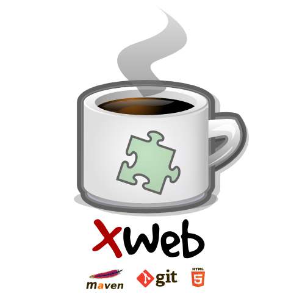

# XWeb



XWeb is simple modular library to create Java based web applications. java is one of the most popular programming languages in use nowadays, with a lot of tutorials, documentation and libraries.

java is also of the most popular programming languages in web applications for mid-size and enterprize projects. There's some powerful and massive size projects, like [Spring Framework ](projects.spring.io/spring-framework), but the problem is, most of these projects are so big and heavy for our purpose and you should load ton of libraries to make simple functionality in your application! But with XWeb, you have many cool features, clean API and you can run it on lightweight application server like [Tomcat ](tomcat.apache.org) and [Jetty ](http://www.eclipse.org/jetty) with less that 1 MB overhead!

Let's look at the main features of XWeb framework:

* Fully modular: You can Use, create and extends modules so simple! Each module also simplify many tasks in your project.
* Data tools: You can validate and generate Java objects from GET and POST requests in single line of code!
* GZip: You can compress everything on the fly. It also support cache for static file.
* Authentication: Full authentication system, support login, captcha, account retrieve, login remember, HTTP authentication and so on.
* Template: Very simple and clear template engine support text and [XSLT](http://en.wikipedia.org/wiki/XSLT) format.
* Resource management: Store, load and manage resources outside of your project. (Support data-resume)
* Security tools: IP detection, Captaha code and ...
* Rewrite/Redirect: Full rewrite/redirect engine (Same as htaccess for Apache)
* Schedule manager: Run any specific task in any specific module in your project.
* Email service: Access email features in entire system.
* Wiki: Every simple and small wiki system. Support Markdom and Mediawiki
* AND MANY OTHER COOL FEATURES!

## Install
Because XWeb is not available in maven repository, you need to clone and install it in your local maven repository
```bash
$ git clone git@github.com:abdollahpour/xweb.git
$ mvn clean install -Dmaven.test.skip=true
```

## How can I use it?
[See Wiki to make your first XWeb applicationn](https://github.com/abdollahpour/xweb/wiki)

## HTML5 client
You can also simply create HTML5 client for you application

[Please see xweb-html5-bootstrap](https://github.com/abdollahpour/xweb-html5-bootstrap)
